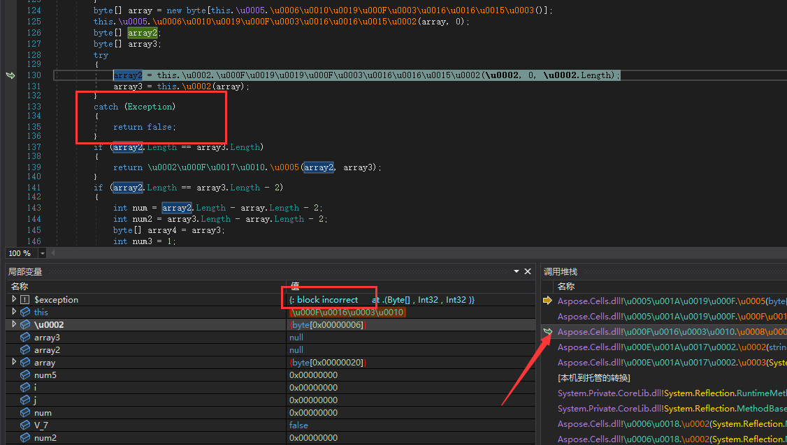
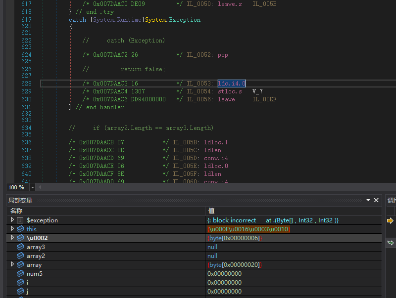
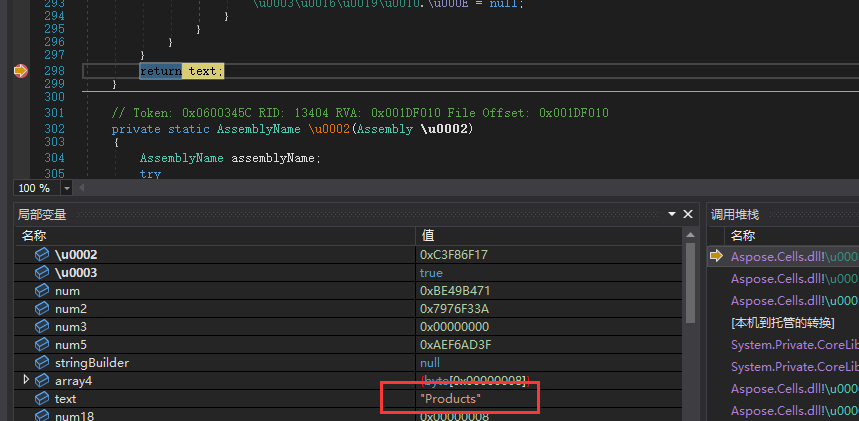
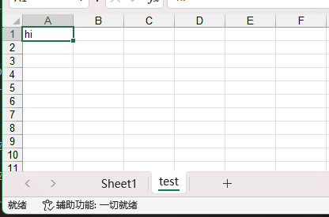

# 0 前言

## 一些想说的话

1. 本分析仅供学习交流使用，请勿用于非法用途
2. 我也没怎么用过这个，就是国庆无聊，图一乐玩一下
3. 今天16:00创建文件夹，大概到18:30，两个半小时搞定；然后重新复现写文章，一直写到22：30

## 大概思路

一般许可证的验证都是这样的：

1. 先准备 `加密密钥` 和 `验证密钥`
2. 由 `数据` 和 `加密密钥` 生成一个签名
3. 把许可证丢给用户
4. 用户的软件会使用 `数据` 和 `验证密钥` 验证数据是否被篡改
5. 被篡改就直接停止程序
6. 没篡改就检测许可证是否过期

所以，一个比较简单的过检测方法就是：

1. 让签名验证始终通过
2. 许可证有效期改成无限长

# 1 写个Demo看看样子

设置证书，参考：https://docs.aspose.com/cells/zh/net/licensing/

下面这个例子创建了一个test工作表，在A1单元格填入了hi字符串。

license.lic内容是空的

```C#
// See https://aka.ms/new-console-template for more information
using Aspose.Cells;

Console.WriteLine("Hello, World!");

var license = new License();
var file = new FileStream("../../../../../license.lic", FileMode.Open);

// license.SetLicense(file);
var excel = new Workbook();
var sheet = excel.Worksheets.Add("test");
sheet.Cells["A1"].Value = "hi";

excel.Save("./test.xlsx", SaveFormat.Xlsx);
```


OK，一切都是符合预期的，只是有个试用警告。去掉它，是本文的目的。

# 2 License 结构分析

Note: 其实网上可以找到，但我觉得分析一下有助于理解。

## 2.1 文件大致结构

1. 去掉demo中的 `// license.SetLicense(file);` 的注释，跑一下

2. 出现了报错，是XML相关的；所有，可以判断license内容是xml格式

    

3. 先随便写，然后跑一下：
    ```xml
    <a>
      <b>msojocs</b>
    </a>
    ```
4. 新的报错，许可证损坏：

    接下来，轮到dnspy出场了！

    

## 2.2 找到license解析的地方

1. 把主程序拖进dnspy，启动！

    设置在入口点断点。

    

2. 在mian里面的excel编辑部分断个点，用于提醒已经开始编辑excel了。

    

3. 出现刚刚的异常，往堆栈上找不到抛出点，只找到一个catch位置，但这不是我们需要的；

    我们需要的是 `throw new XxxException`（此处是 `System.IO.IOException`）

    

4. 这个简单，在异常设置里面把 `System.IO.IOException` 打上勾，再跑一下，轻松找到。

    

5. 再这个方法的开头下断点，然后debug，看它在干嘛。

    参数内容开头是 `3C613E` 转成字符串是 `<a>` 看来就是刚刚随便写的许可证内容。

    所以这部分大概就是许可证（license）的解析了。
  
    

## 2.3 分析license结构

1. 看代码，此处在比较xml的节点名称，应该在找配置信息；（此处很关键）

    （1）是当前节点名称，在（2）可以看到是b，也就是我们上面瞎写的；

    而（3）表达式的右侧就是目标名称，虽然不好看，但返回值一定是字符串。

    > 根据我的经验，一般字符串加密会使用 `string codeToName(int code)` 的方式取得字符串；
    > 
    > 所以，这个方法大概率会重复使用，它会帮助我们判断程序在干什么。
    > 
    > 这个很关键！！！

    

2. 进入 `\u0003\u0016\u0019\u0010.\u0002(int \u0002)` 给返回值下断点，

    `\u0003\u0016\u0019\u0010.\u0002(int \u0002, bool \u0003)` 里面的也一起下断点。

    

3. debug走下一步，看返回，名称是"Data"：

    > 注意：
    > 
    > 建议给每个加密字符串加书签。

    

    下一步，是 'Signature'

    

4. 根据调试看到的参数跳转结构补一下结构：

    Q: 为什么有个xml层？
    
    A: 自己看代码~

    ```xml
    <xml>
      <Data>数据</Data>
      <Signature>签名</Signature>
    </xml>
    ```

5. 审查代码，可以看到签名是Base64

    

    '123456' 转base64 'MTIzNDU2'，填进去

    ```xml
    <xml>
      <Data>数据</Data>
      <Signature>MTIzNDU2</Signature>
    </xml>
    ```
6. 往下走，看起来Data里面至少还有两个节点：

    SubscriptionExpiry 和 LicenseExpiry

    加到license里面，内容感觉是时间，先写成这样：

    ```xml
    <xml>
      <Data>
        <SubscriptionExpiry>2099-01-01 00:00:00</SubscriptionExpiry>
        <LicenseExpiry>2099-01-01 00:00:00</LicenseExpiry>
      </Data>
      <Signature>MTIzNDU2</Signature>
    </xml>
    ```

    

    

## 2.4 去除Signature校验

OK，上面对于license的基本结构已经有了一定认识，接下来对一些验证做处理。

1. 加完之后重新跑，抛出一个异常：

    

    如果你没有停住，可能需要开启异常设置里面的第一个选项：

    

2. 不知道上面在干嘛？

    没事，顺着堆栈往回看变量的值

    突然数据量大了，熟悉的数值`65537` (你可以搜索引擎查找”加密 65537“，就能得到信息)

    这个入口的`array`是什么，逆流向上可以得知是`Signature`的值，

    也就是说程序在使用RSA对许可证的签名进行校验。

    由于RSA有公钥私钥两份文件，程序只会放一份，另一份在软件开发者手里，我们是伪造不了的；

    所以，校验必然失败，只能在里面校验的时候强行返回成功。

    

3. 从上面分析得知，调用的方法必须强行返回true或者false

    我们继续执行，回发现程序进不到`284行`进行等于0的操作（异常被捕获了）

    因此，必须让此处返回true。

    观察其中堆栈，有一个异常捕获返回false，把它改成true。
    
    

    查看IL代码，需要把 `ldc.i4.0` 改成 `ldc.i4.1`

    

4. 使用VS Code打开Aspose.Cells.dll

    替换十六进制`161307DD94` -> `171307DD94` (step1)

    

5. 重跑，看效果。阶段性成功。

    

    

## 2.5 补全缺失数据

1. 继续执行抛出`System.ArgumentNullException`

    一样的，在异常设置打勾，重跑；然后找上级。

    呃，没找到。。。

    

2. 卡住了，找不到调用源头；

    还记得前面提到的字符串加密方法吗，我们从它的返回值中找找看。

    这可不是靠运气，要观察每个字符串的外部调用方法。

    果然给我找到了，这个Products前面没见过，但是它的调用代码出现了xml处理与一些License字段；

    经过调试查看变量，确定这是缺少的数据。补全后：

    ```xml
    <xml>
      <Data>
        <SubscriptionExpiry>2099-01-01 00:00:00</SubscriptionExpiry>
        <LicenseExpiry>2099-01-01 00:00:00</LicenseExpiry>
        <Products>products</Products>
        <EditionType>type</EditionType>
        <SerialNumber>num</SerialNumber>
      </Data>
      <Signature>MTIzNDU2</Signature>
    </xml>
    ```
    

    

3. 重新执行，出现`InvalidOperationException`，按前面操作一遍，看到具体位置：

    是EditionType错误，调试可以知道取值 'Professional' 或者 'Enterprise';

    我填了 'Enterprise'

    

    ```xml
    <xml>
      <Data>
        <SubscriptionExpiry>2099-01-01 00:00:00</SubscriptionExpiry>
        <LicenseExpiry>2099-01-01 00:00:00</LicenseExpiry>
        <Products>products</Products>
        <EditionType>Enterprise</EditionType>
        <SerialNumber>num</SerialNumber>
      </Data>
      <Signature>MTIzNDU2</Signature>
    </xml>
    ```

4. 继续跑，提示product不适用

    

5. 跳到Products的代码处Debug（之前加过书签），发现products应该还有子项product

    

    ```xml
    <xml>
      <Data>
        <SubscriptionExpiry>2099-01-01 00:00:00</SubscriptionExpiry>
        <LicenseExpiry>2099-01-01 00:00:00</LicenseExpiry>
        <Products>
          <Product>aaa</Product>
        </Products>
        <EditionType>Enterprise</EditionType>
        <SerialNumber>num</SerialNumber>
      </Data>
      <Signature>MTIzNDU2</Signature>
    </xml>
    ```
6. 往下单步调试，可以看到产品名称 "Aspose.Excel"

    

    ```xml
    <xml>
      <Data>
        <SubscriptionExpiry>2099-01-01 00:00:00</SubscriptionExpiry>
        <LicenseExpiry>2099-01-01 00:00:00</LicenseExpiry>
        <Products>
          <Product>Aspose.Excel</Product>
        </Products>
        <EditionType>Enterprise</EditionType>
        <SerialNumber>num</SerialNumber>
      </Data>
      <Signature>MTIzNDU2</Signature>
    </xml>
    ```

7. 继续跑，出现 `System.FormatException`；

    定位到触发点，正确格式是 "yyyyMMdd"

    

    ```xml
    <xml>
      <Data>
        <SubscriptionExpiry>20990101</SubscriptionExpiry>
        <LicenseExpiry>20990101</LicenseExpiry>
        <Products>
          <Product>Aspose.Excel</Product>
        </Products>
        <EditionType>Enterprise</EditionType>
        <SerialNumber>num</SerialNumber>
      </Data>
      <Signature>MTIzNDU2</Signature>
    </xml>
    ```
# 3 似乎可以了

跑一下程序，没有非预期异常，产生的文件没有水印；

为什么说”似乎“，因为我没有太多例子测试，不知道有没有什么隐藏的检查。

我把时间改到今天以前，会出现水印，改到今天之后就没有了。

  
